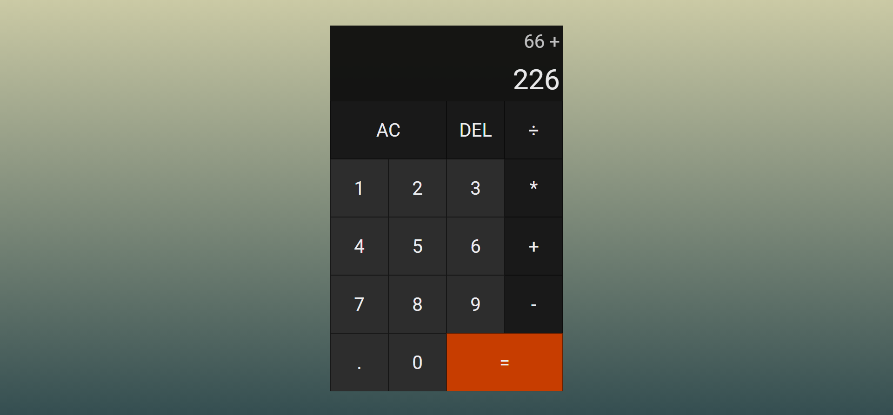

# JavaScript Calculator
> A simple JavaScript Calculator

## Table of contents
* [Technologies](#technologies)
* [Screenshots](#screenshots)
* [Status](#status)

## Technologies
* HTML
* CSS
* JavaScript

## Screenshots

## Status
Project is: Completed
